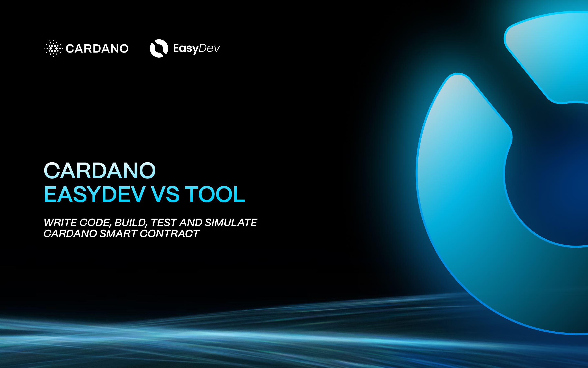

# Product Overview

## What is Cardano EasyDev VS Tool?

**Cardano EasyDev VS Tool** is a powerful **VS Code extension** designed specifically for **Cardano blockchain developers**. It streamlines the development process by providing comprehensive tools for **smart contract development, dApp creation, and blockchain interaction**—all within your preferred code editor.

This extension is tailored to simplify and **accelerate the development cycle** on the Cardano ecosystem by offering direct **Aiken language support, transaction building**in one seamless package.

<figure><figcaption>
Cardano EasyDev VS Tool
</figcaption></figure>

## Why Use Cardano EasyDev VS Tool?

Developing on **Cardano** presents unique challenges that this tool effectively addresses:

* 🚀 **Simplified Smart Contract Development**: Write, build, and test **Aiken contracts** directly within VS Code—eliminating the need to switch between multiple tools and command-line interfaces.
* 🏗 **Project Scaffolding**: Instantly generate complete **project structures**, including frontend and validator components with a single click.
* 🔗 **Blockchain Interaction Tools**: Manage wallets, build transactions, and **sign transaction** without leaving VS Code.

## Key Features

### **Smart Contract Development**

* Direct **Aiken build and test execution** within VS Code
* Integrated **plutus.json** interaction and validation

### **dApp Development Acceleration**

* One-click **project template generation** for faster development
* Built-in **frontend component** for seamless dApp integration

### **Comprehensive Blockchain Tools**

* **Wallet management** and integration
* **Transaction building and signing**

## How It Benefits Developers

By consolidating these powerful tools into a single extension, **Cardano EasyDev VS Tool** significantly reduces **development time**, minimizes **setup complexity**, and enhances the overall **developer experience** within the Cardano ecosystem.

### **Get Started Today**

📌 Install the extension from the **VS Code Marketplace** and supercharge your **Cardano development workflow**.

<table data-view="cards"><thead><tr><th></th><th data-type="content-ref"></th></tr></thead><tbody><tr><td></td><td><a href="roadmap.md">roadmap.md</a></td></tr><tr><td></td><td><a href="contribution-guide/">contribution-guide</a></td></tr><tr><td></td><td><a href="features/">features</a></td></tr><tr><td></td><td><a href="techstack/">techstack</a></td></tr><tr><td></td><td><a href="links/">links</a></td></tr><tr><td></td><td><a href="changelog.md">changelog.md</a></td></tr></tbody></table>

