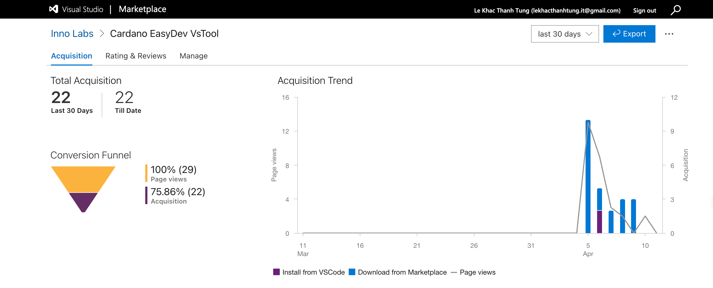

# Close-out Report F13

Name of Project on IdeaScale/Fund: **Cardano EasyDev VS Tool**

Project URL on IdeaScale/Fund: [https://projectcatalyst.io/funds/13/cardano-open-developers/cardano-easydev-vs-tool](https://projectcatalyst.io/funds/13/cardano-open-developers/cardano-easydev-vs-tool)

Project Number: **#1300040**

Project Manager: **Hien Phan**

Date Project Started: **Jan 2025**

Date Project Completed: **April 2025**

***

## Challenge KPIs and How They Were Addressed

1.  **Enhanced Developer Adoption**

    The project developed a Visual Studio Code (VS Code) extension that simplifies the smart contract development process through a graphical user interface (GUI). This tool lowers the entry barrier for developers new to Cardano, streamlining the development process and encouraging wider adoption.
2.  **Increased Community Engagement**

    By open-sourcing all source code under the Apache 2.0 license, the project promotes transparency and collaboration. This approach invites community contributions, fostering a vibrant and engaged developer community around the tool.

***

## **Project KPIs and How They Were Addressed**

1.  **Completion of Development Milestones:**

    The project set clear milestones, with each milestone supported by evidence linked below:

    * **Milestone 1:** Project setup and design documentation, including UI/UX and user flow. [Link](https://milestones.projectcatalyst.io/projects/1300040/milestones/1)
    * **Milestone 2:** Development of account management features, creation of a DApp template, and integration with the Aiken CLI. [Link](https://milestones.projectcatalyst.io/projects/1300040/milestones/2)
    * **Milestone 3:** Smart contract testing, publishing the extension, and preparing the close-out report. [Link](https://milestones.projectcatalyst.io/projects/1300040/milestones/3)
2.  **Tool Adoption and Usage Metrics:**

    The project's focus on developing a user-friendly VsCode extension suggests an intent to monitor and report on how widely the tool is adopted and utilized within the Cardano developer community. Tracking downloads, active users, and feedback would provide insights into the tool's impact and areas for improvement.

    <figure><figcaption></figcaption></figure>
3. **Developer Documentation:** Comprehensive developer documentation was created, including usage examples and tutorials. This documentation serves as a resource to help developers integrate and effectively use the extension.
4. **Publishing the Extension:** The extension was published on the **VSCode Marketplace** to increase visibility and engagement with the developer community. This step was taken to facilitate the adoption of the tool among Cardano developers.

***

## **Key Achievements**

* **Collaboration & Engagement**: \[Highlight key achievements, particularly collaboration with other stakeholders and engagement with the community or users]
* **Technical Achievements**: \[Mention significant technical accomplishments, such as new features developed or technical challenges overcome]

***

## **Key Learnings**

* Gained knowledge on how to propose ideas and implement projects.
* User feedback and opinions will help improve the product's quality and UX.
* Gained more experience using off-chain interaction SDKs and developing smart contracts on the Cardano blockchain.

***

## **Next Steps for the Product or Service Developed**

* Fix bugs and resolve any critical issues
* Improve the UI/UX design for an enhanced user experience
* Add additional features to feedback, such as minting and burning NFTs
* Include more DApp templates
* Refactor the source code to simplify contributions
* Optimize performance for better efficiency
* Implement analytics to gain insights into user behavior and feedback

***

## **Final Thoughts/Comments:**

A big thank you to everyone who reviewed milestones, voted on our proposal, and supported us in many ways. As a small but effective open-source project, we truly appreciate all the help and encouragement we've received from the Cardano Ecosystem. Your support has meant a lot, and we look forward to continuing this journey together. Thank you for being a key part of our progress.

***

## **Links to Other Relevant Project Sources or Documents**

* Repositories
  * Frontend - Extension: [https://github.com/Innovate-Lab/cardano-easydev-vstool-frontend-extension](https://github.com/Innovate-Lab/cardano-easydev-vstool-frontend-extension)
  * Backend: [https://github.com/Innovate-Lab/cardano-easydev-vstool-backend](https://github.com/Innovate-Lab/cardano-easydev-vstool-backend)
* Documentation: [https://innolab.gitbook.io/cardano-easydev-vs-tool](https://innolab.gitbook.io/cardano-easydev-vs-tool)
* Figma: [https://www.figma.com/design/lM5rcmxr1bLpkB3JU4mI6q/Simulator?node-id=0-1\&p=f\&t=Px7Dg0YTxSMl7Vxz-0](https://www.figma.com/design/lM5rcmxr1bLpkB3JU4mI6q/Simulator?node-id=0-1\&p=f\&t=Px7Dg0YTxSMl7Vxz-0)
* Landing page: [https://cardano-easydev-vstool-landing-page.vercel.app/](https://cardano-easydev-vstool-landing-page.vercel.app/)

***

## **Link to Close-out Video**

