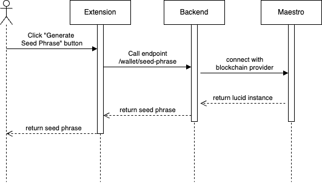

# Account Creation

### Overview

This feature enables new users to create and set up their Cardano wallet within the extension by creating their seed phrase and private key credentials.

✅ **User Story:**

> As a new user, I want to create a new Cardano wallet address with a seed phrase and private key

✅ **User Flow:**

1. Users click "Generate Private Key" button in the extension
2. Extension makes API call to backend endpoint `/wallet/private-key` | `/wallet/seed-phrase`
3. Backend connects with blockchain provider (Maestro,...)
4. Private key / seed phrase is generated and returned through the chain
5. User receives their generated private key / seed phrase

### 🔄 User Flow Diagrams

#### Seed Phrase Entry Flow

<figure><figcaption></figcaption></figure>

#### Private Key Generation Flow

<figure><figcaption></figcaption></figure>

⚠️ **Important Security Notice:** The generated private keys and seed phrases from this flow should only be used in development environments. Never use development-generated credentials for production wallets or real funds.

## Demo

