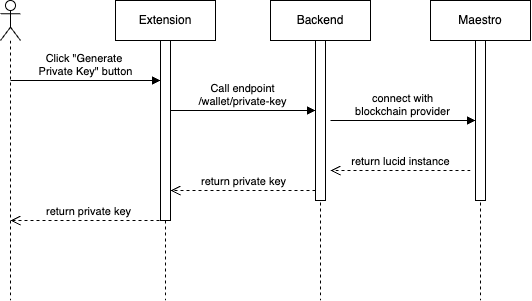
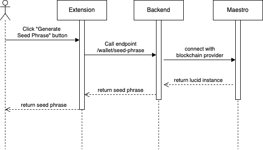
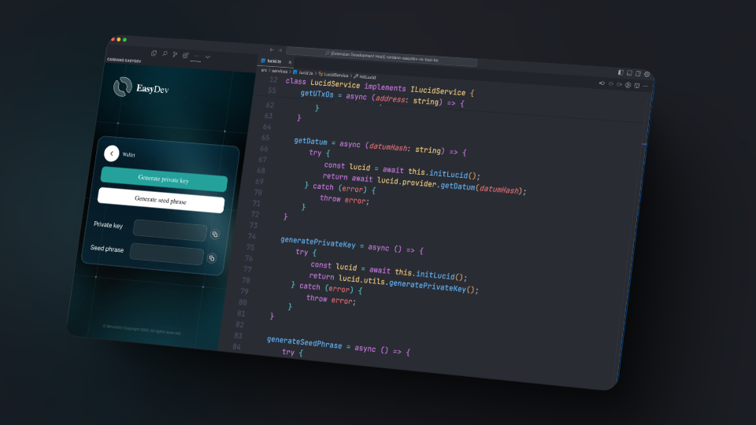

# Account Creation

## Overview

This feature allows users to create their Cardano wallet within the extension by generating seed phrase and private key credentials.

## **User Story**

> As a user, I want to create a new Cardano wallet with a seed phrase and private key

## **User Flow**



Users click "Generate Private Key | Seed Phrase" button in the extension



Extension makes API call to backend endpoint `/wallet/private-key` | `/wallet/seed-phrase`&#x20;



Backend connects with blockchain provider (Maestro,...)



Private key / seed phrase is generated and returned



Extension receives their generated private key / seed phrase



## User Flow Diagrams

### Seed Phrase Entry Flow

<figure><figcaption></figcaption></figure>

### Private Key Generation Flow

<figure><figcaption></figcaption></figure>

## ⚠️ **Important Security Notice:**&#x20;

* The generated private keys and seed phrases from this flow should only be used in development environments.&#x20;
* Never use development-generated credentials for production wallets or real funds.

## Troubleshooting & Common Issues

| **Issue**                                   | **Possible Cause**        | **Solution**                  |
| ------------------------------------------- | ------------------------- | ----------------------------- |
| Private key or Seed Phrase is not generated | API request failed        | Check console logs for errors |
| "Request Timed Out" error                   | Network issue or API down | Retry after a few minutes     |

## API Reference

### Generate Private Key

<mark style="color:green;">`POST`</mark> `/wallet/private-key`

Generate new private key

**Headers**

| Name         | Value              |
| ------------ | ------------------ |
| Content-Type | `application/json` |

**Body**

**Response**



```json
{
  "code": 200,
  "msg": "",
  "data": {
    "privateKey": ""
  }
}
```



```json
{
  "code": ,
  "msg": "",
  "data": {
  
  }
}
```



### Generate Seed Phrase

<mark style="color:green;">`POST`</mark> `/wallet/seed-phrase`

Generate new seed phrase

**Headers**

| Name         | Value              |
| ------------ | ------------------ |
| Content-Type | `application/json` |

**Body**

**Response**



```json
{
  "code": 200,
  "msg": "",
  "data": {
    "seedPhrase": ""
  }
}
```



```json
{
  "code": ,
  "msg": "",
  "data": {
  
  }
}
```



## Demo

### Screenshot

<figure><figcaption></figcaption></figure>

### Video



🔹 _For any issues, please refer to the_ [_Troubleshooting Section_](account-creation.md#troubleshooting-and-common-issues) _or open an Issue on GitHub._

