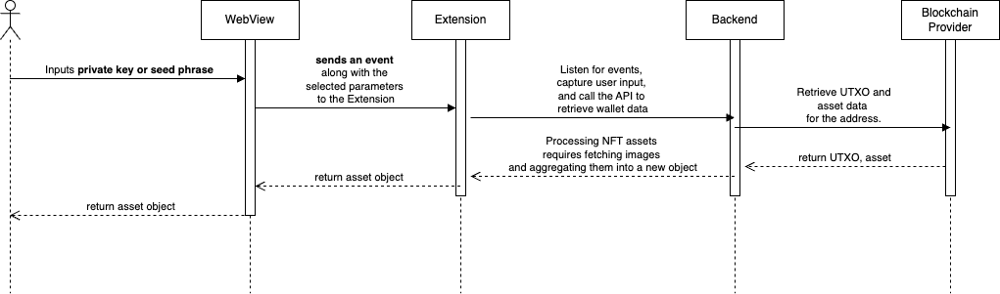

# Account Management

## Overview

This feature allows users to **view their wallet details**, including **wallet address, UTXOs (Unspent Transaction Outputs), assets, and NFTs** directly within the extension

## **User Story**

> **As a user, I want to view my wallet address, UTXO, assets, and NFTs within the extension.**

## **User Flow**



User navigate to the **"Wallet"** page in the extension.



The extension makes an API call to retrieve wallet data.



The backend interacts with the blockchain provider to retrieve and process wallet data before responding to the extension



The **wallet address, UTXOs, assets, and NFTs** are displayed.



## User Flow Diagrams

<figure><figcaption></figcaption></figure>

## Troubleshooting & Common Issues

Coming soon

## API Reference

Coming soon

## Demo

Coming soon

🔹 _For any issues, please refer to the_ [_Troubleshooting Section_](account-management.md#troubleshooting-and-common-issues) _or open an Issue on GitHub._
