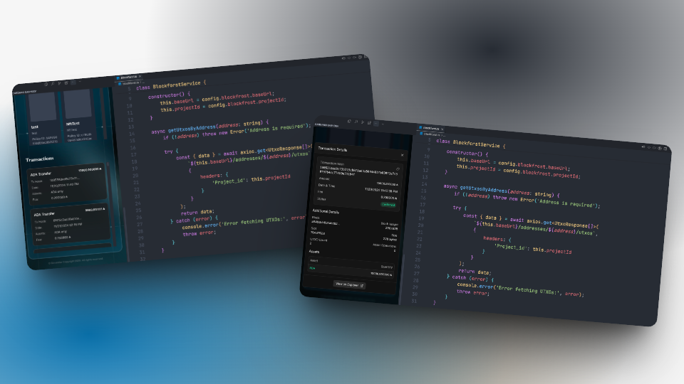

# Wallet Management

## Overview

This feature enables users to efficiently track transactions of wallet

## **User Story**

> As a user, I want to track transactions of wallet seamlessly.

## **User Flow**



User navigate to the **"Wallet"** page in the extension.



The extension calls the backend API to retrieve transaction data



The backend fetches transaction data via blockchain provider and aggregates the transaction list



User can view Transaction Details



## User Flow Diagrams

<figure><figcaption></figcaption></figure>

## Troubleshooting & Common Issues

| **Issue**                                         | **Possible Cause**        | **Solution**                  |
| ------------------------------------------------- | ------------------------- | ----------------------------- |
| Unable to retrieve transactions of wallet address | API request failed        | Check console logs for errors |
| "Request Timed Out" error                         | Network issue or API down | Retry after a few minutes     |

## API Reference

### Get Detail Transactions

Get detail transactions of address

<mark style="color:green;">`GET`</mark> /wallet/transactions

**Headers**

| Name         | Value              |
| ------------ | ------------------ |
| Content-Type | `application/json` |

**Query Params**

| Name    | Type   | Description            |
| ------- | ------ | ---------------------- |
| address | string | Cardano wallet address |

**Response**



```json
{
    "data": {
        "transactions": 
            {
                "hash": "1e1390bd3881f336dc8f857868539549e769c3d7b99207d40b59e65347f19199",
                "block": "b5f36addb2d2687ad19fd28b615a4ef2f806b56e9b7e20cff0cccf1e7dee2488",
                "block_height": 2910905,
                "block_time": 1732198273,
                "slot": 76515073,
                "index": 4,
                "output_amount": [
                    {
                        "unit": "lovelace",
                        "quantity": "9997398435"
                    },
                    {
                        "unit": "99067d535a1cc020b579d96ca427ec12625eb5afd80383227831a094",
                        "quantity": "1"
                    }
                ],
                "fees": "194987",
                "deposit": "0",
                "size": 880,
                "invalid_before": null,
                "invalid_hereafter": null,
                "utxo_count": 3,
                "withdrawal_count": 0,
                "mir_cert_count": 0,
                "delegation_count": 0,
                "stake_cert_count": 0,
                "pool_update_count": 0,
                "pool_retire_count": 0,
                "asset_mint_or_burn_count": 1,
                "redeemer_count": 1,
                "valid_contract": true
            }
        ]
    },
    "msg": "OK",
    "code": 201
}
```



```json
{
  "code": ,
  "msg": "",
  "data": {
  
  }
}
```



## Demo

### Screenshot

<figure><figcaption></figcaption></figure>

### Video



🔹 _For any issues, please refer to the_ [_Troubleshooting Section_](wallet-management.md#troubleshooting-and-common-issues) _or open an Issue on GitHub._
