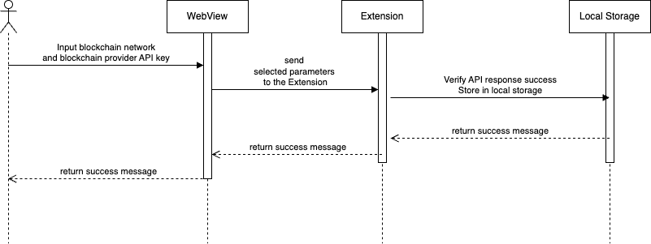
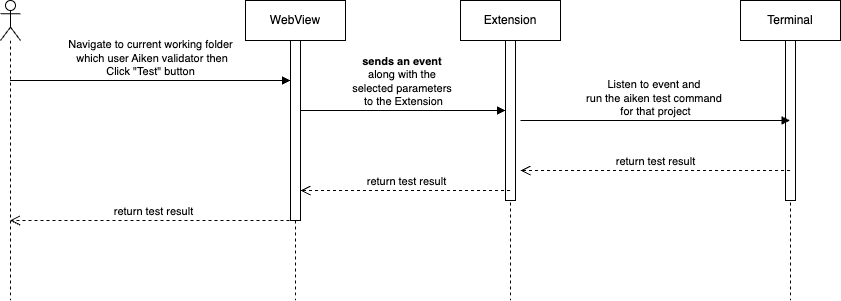

# 2. Aiken CLI Interaction

<figure><figcaption></figcaption></figure>

## Overview

This feature enables users to configure their blockchain provider settings by selecting a network and entering a Blockchain Provider API key (Blockfrost, Maestro). Additionally, users can build a validator into a **Plutus JSON file** and run unit tests to ensure the validator functions correctly without errors or bugs.

## **User Story**

> As a user, I want to configure my blockchain provider by selecting a network and entering an API key (Blockfrost, Maestro). Furthermore I can build a validator into a Plutus JSON file and run unit tests to verify its correctness, ensuring there are no errors or bugs before deployment.

## **User Flow**

### **Setup Blockchain Provider**



User navigates to the **Development** page in the extension.



User selects a blockchain network from the dropdown menu

* Preprod
* Preview



User enters the Blockchain Provider API key in the provided field.



The system saves the data in the extension storage for future use



### Build Validator



User navigates to the **Development** page in the extension



The user selects the current working folder that uses the Aiken validator for the project



User clicks "Build"



System generates the Plutus JSON file.



### Test Validator



User navigates to the **Development** page in the extension



The user selects the current working folder that uses the Aiken validator for the project



User clicks "Test"



The system will check for syntax errors and execute all unit tests defined in the validator.



## User Flow Diagrams

### Setup Blockchain Provider

<figure><figcaption></figcaption></figure>

### Build Validator

<figure><figcaption></figcaption></figure>

### Test Validator

<figure><figcaption></figcaption></figure>

## Troubleshooting & Common Issues

Coming soon

## API Reference

Coming soon

## Demo

Coming soon

🔹 _For any issues, please refer to the_ [_Troubleshooting Section_](2.-aiken-cli-interaction.md#troubleshooting-and-common-issues) _or open an Issue on GitHub._
