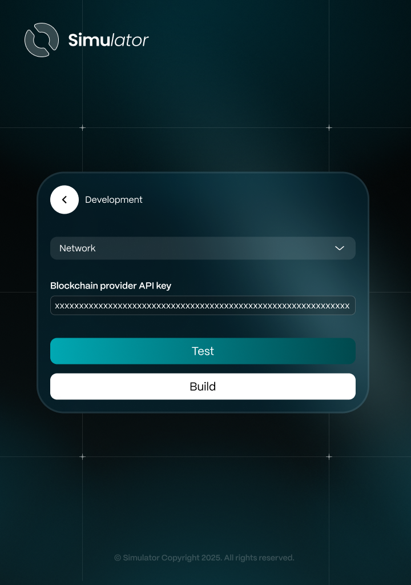

# 2. Aiken CLI Interaction

<figure><figcaption></figcaption></figure>

## Overview

This feature allows users to&#x20;

## **User Story**

> As a user, I want to&#x20;

## **User Flow**







## User Flow Diagrams

## Troubleshooting & Common Issues

Coming soon

## API Reference

Coming soon

## Demo

Coming soon

🔹 _For any issues, please refer to the_ [_Troubleshooting Section_](2.-aiken-cli-interaction.md#troubleshooting-and-common-issues) _or open an Issue on GitHub._
