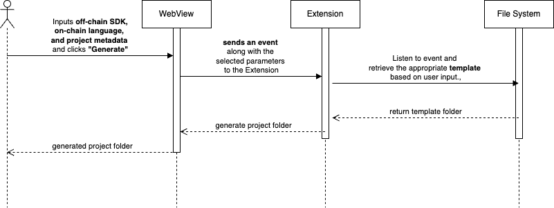

# 3. Create DApp Template

<figure><figcaption></figcaption></figure>

## Overview

This feature allows users to quickly generate a decentralized application (Dapp) template with predefined configurations, enabling faster development on the Cardano blockchain. It simplifies the setup process, providing essential components and dependencies for building a functional Dapp.

## **User Story**

> _As a user, I want to generate a pre-configured Dapp template so that I can streamline development and focus on building my application without manually setting up the project structure._

## **User Flow**



**User navigates to the "Create Dapp Template" page**



The system display a **form with three input fields**:

* **Off-chain Interaction SDK** (Lucid, Mesh,...)
* **On-chain Programming Language** (currently support Aiken)
* **Project Metadata** (Project name,...)



**User clicks the "Generate" button**, initiating the project creation process.



The system **automatically generates the Dapp template** based on the selected parameters.



**User** can begins development



## User Flow Diagrams

<figure><figcaption></figcaption></figure>

Note:

* We will set up several templates that align with **Cardano's best practices** and meet project requirements.
* The system will further process project metadata to enhance **frontend integration** and customization.

## Troubleshooting & Common Issues

Coming soon

## API Reference

Coming soon

## Demo

Coming soon

🔹 _For any issues, please refer to the_ [_Troubleshooting Section_](3.-create-dapp-template.md#troubleshooting-and-common-issues) _or open an Issue on GitHub._
