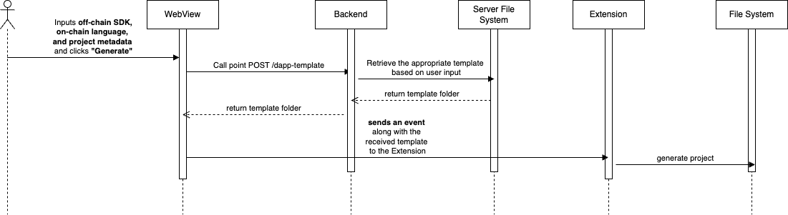

# 3. Create DApp Template

<figure><figcaption></figcaption></figure>

## Overview

This feature allows users to quickly generate a decentralized application (Dapp) template with predefined configurations, enabling faster development on the Cardano blockchain. It simplifies the setup process, providing essential components and dependencies for building a functional Dapp.

## **User Story**

> _As a user, I want to generate a pre-configured Dapp template so that I can streamline development and focus on building my application without manually setting up the project structure._

## **User Flow**



**User navigates to the "Create Dapp Template" page**



The system display a **form with three input fields**:

* **Off-chain Interaction SDK** (Lucid, Mesh,...)
* **On-chain Programming Language** (currently support Aiken)
* **Project Metadata** (Project name,...)



**User clicks the "Generate" button**, initiating the project creation process.



The system **automatically generates the Dapp template** based on the selected parameters.



**User** can begins development



## User Flow Diagrams

<figure><figcaption></figcaption></figure>

Note:

* We will set up several templates that align with **Cardano's best practices** and meet project requirements.
* The system will further process project metadata to enhance **frontend integration** and customization.

## Troubleshooting & Common Issues

| **Issue**                       | **Possible Cause**        | **Solution**                  |
| ------------------------------- | ------------------------- | ----------------------------- |
| Unable to retrieve the template | API request failed        | Check console logs for errors |
| "Request Timed Out" error       | Network issue or API down | Retry after a few minutes     |

## API Reference

<mark style="color:green;">`POST`</mark> /dapp-template

Get dapp template

**Headers**

| Name         | Value              |
| ------------ | ------------------ |
| Content-Type | `application/json` |

**Body**

| Name        | Type   | Description |
| ----------- | ------ | ----------- |
| offChainSDK | string |             |
| language    | string |             |

**Response**



```json
{
    "data": {
        "success": true,
        "data": {
            "name": "lucid-aiken",
            "type": "directory",
            "children": [
                {
                    "name": "aiken",
                    "type": "directory",
                    "children": [
                        {
                            "name": "README.md",
                            "type": "file",
                            "content": "# \n\nWrite validators in the `validators` folder..."
                        },
                        {
                            "name": "aiken.toml",
                            "type": "file",
                            "content": "name = \"\"\nversion = \"0.0.0\"\n..."
                        },
                        {
                            "name": "validators",
                            "type": "directory",
                            "children": [
                                {
                                    "name": "contract.ak",
                                    "type": "file",
                                    "content": ""
                                }
                            ]
                        }
                    ]
                },
                {
                    "name": "frontend",
                    "type": "directory",
                    "children": [
                        {
                            "name": "eslint.config.js",
                            "type": "file",
                            "content": "import js from '@eslint/js'\n..."
                        },
                        {
                            "name": "index.html",
                            "type": "file",
                            "content": "<!doctype html>\n<html lang=\"en\">..."
                        }
                    ]
                }
            ]
        }
    },
    "msg": "OK",
    "code": 201
}

```



```json
{
  "code": ,
  "msg": "",
  "data": {
  
  }
}
```



## Demo

### Screenshot

<figure><figcaption></figcaption></figure>

### Video


🔹 _For any issues, please refer to the_ [_Troubleshooting Section_](3.-create-dapp-template.md#troubleshooting-and-common-issues) _or open an Issue on GitHub._
