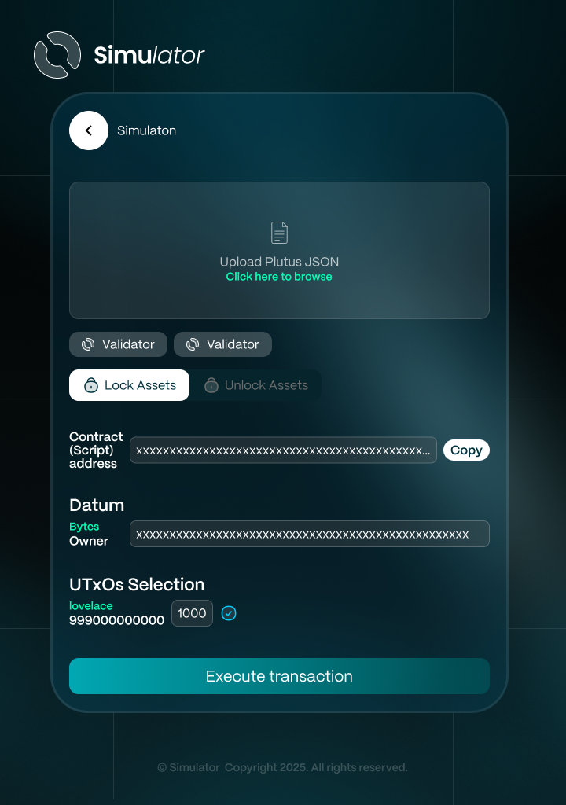

# 4. Simulation

<figure><figcaption></figcaption></figure>

## Overview

This feature enables users to interact with a **validator (smart contract)** by uploading a **Plutus JSON file** compiled from Aiken using the **Aiken CLI compiler**. Users can specify a **Datum**, **Redeemer,** select **UTXOs**, and **lock/unlock assets** to seamlessly test and validate the contract’s behavior.

## **User Story**

> _As a user, I want to interact with a validator (smart contract) by uploading a Plutus JSON file compiled from Aiken, specifying a datum, redeemer, selecting UTXOs, and locking/unlocking assets so that I can test and validate the contract’s behavior before executing transactions mainnet._

## **User Flow**



User navigates to the **Simulation** page in the extension.



User uploads a Plutus JSON file generated using the Aiken compiler



User selects whether to lock or unlock assets (Spending Validator) based on the contract interaction requirements.



User enters a datum or redeemer as required by the contract



User selects UTXOs for transaction.



User clicks 'Execute transaction' to initiate the transaction process.



The system interacts with the blockchain provider to process the transaction.



## User Flow Diagrams

<figure><figcaption></figcaption></figure>

## Troubleshooting & Common Issues

| **Issue**                 | **Possible Cause**        | **Solution**                  |
| ------------------------- | ------------------------- | ----------------------------- |
| Unable to                 | API request failed        | Check console logs for errors |
| "Request Timed Out" error | Network issue or API down | Retry after a few minutes     |

## API Reference

### Get Contract (Validator) Address

Get address of contract (validator)

<mark style="color:green;">`POST`</mark> /validator/address

**Headers**

| Name         | Value              |
| ------------ | ------------------ |
| Content-Type | `application/json` |

**Body**

| Name         | Type   | Description |
| ------------ | ------ | ----------- |
| compiledCode | string |             |

**Response**



```json
{
    "data": {
        "contractAddress": ""
    },
    "msg": "OK",
    "code": 201
}
```



```json
{
  "code": ,
  "msg": "",
  "data": {
  
  }
}
```



### Execute Transaction

<mark style="color:green;">`POST`</mark> /validator/execute

Execute transaction from validator

**Headers**

| Name         | Value              |
| ------------ | ------------------ |
| Content-Type | `application/json` |

**Body**

| Name            | Type                                                                                         | Description                                             |
| --------------- | -------------------------------------------------------------------------------------------- | ------------------------------------------------------- |
| datumOrRedeemer | <p>{<br>    "dataType": string,</p><p>    "title": string,</p><p>    "value: string<br>}</p> | Lock uses datum; unlock uses redeemer                   |
| contractAddress | string                                                                                       |                                                         |
| seedPhrase      | string                                                                                       | To access your wallet                                   |
| isLock          | boolean                                                                                      | For Spending Validator (2 modes: lock and unlock)       |
| validator       | <p>{<br>    "type": string,</p><p>    "script": string<br>}</p>                              | Format required for Lucid SDK to execute a transaction" |
| unitsQuantity   | { \[key: string]: number \| bigint }                                                         | Amount of native token (lovelace) or other assets       |

**Response**



```json
{
    "data": {
       "txHash": ""
    },
    "msg": "OK",
    "code": 201
}

```



```json
{
  "code": ,
  "msg": "",
  "data": {
  
  }
}
```



## Demo

### Screenshot

<figure><figcaption></figcaption></figure>


### Video


🔹 _For any issues, please refer to the_ [_Troubleshooting Section_](4.-simulation.md#troubleshooting-and-common-issues) _or open an Issue on GitHub._
