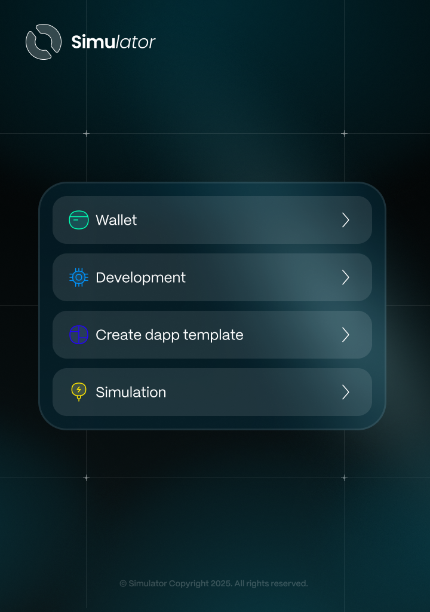

# Features

<figure><figcaption></figcaption></figure>

<table data-view="cards"><thead><tr><th></th><th data-type="content-ref"></th><th data-hidden data-card-cover data-type="files"></th></tr></thead><tbody><tr><td></td><td><a href="1.-user-wallet/">1.-user-wallet</a></td><td><a href="../.gitbook/assets/Wallet.png">Wallet.png</a></td></tr><tr><td></td><td><a href="2.-aiken-cli-interaction.md">2.-aiken-cli-interaction.md</a></td><td><a href="../.gitbook/assets/Development.png">Development.png</a></td></tr><tr><td></td><td><a href="3.-create-dapp-template.md">3.-create-dapp-template.md</a></td><td><a href="../.gitbook/assets/Dapp template.png">Dapp template.png</a></td></tr><tr><td></td><td><a href="4.-simulation.md">4.-simulation.md</a></td><td><a href="../.gitbook/assets/Simulation.png">Simulation.png</a></td></tr></tbody></table>

