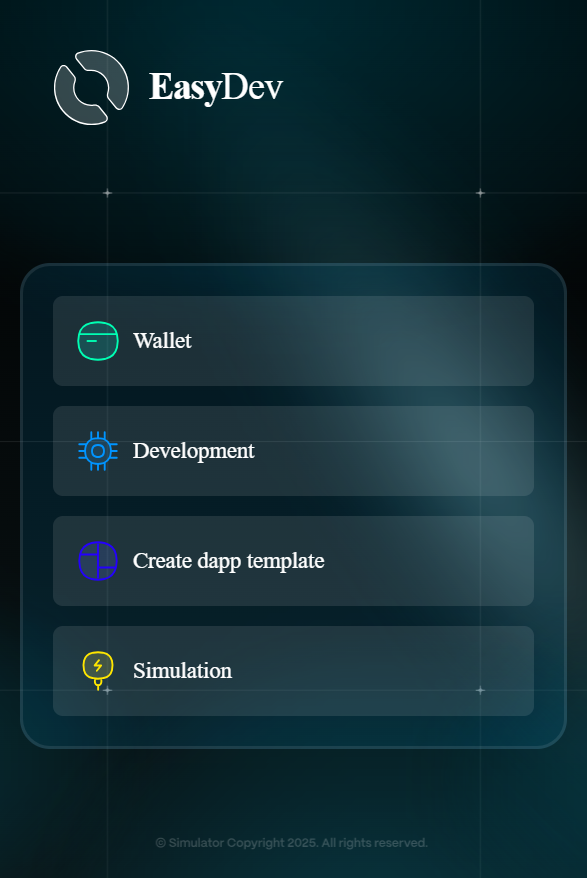

# 2. Aiken CLI Interaction



User navigate to the **"Development"** page in the extension.

<figure><figcaption></figcaption></figure>



The user selects a **blockchain network** from the dropdown menu, enters the **Blockchain Provider API key** in the designated field, chooses the **current working folder** that uses the Aiken validator for the project, and then clicks the **Build** or **Test** button.

<figure><figcaption></figcaption></figure>



If the user clicks **Build**, the system generates the **Plutus JSON** file and checks for syntax errors. If the user clicks **Test**, the system executes all **unit tests** defined in the validator.

<figure><figcaption></figcaption></figure> <figure><figcaption></figcaption></figure>



