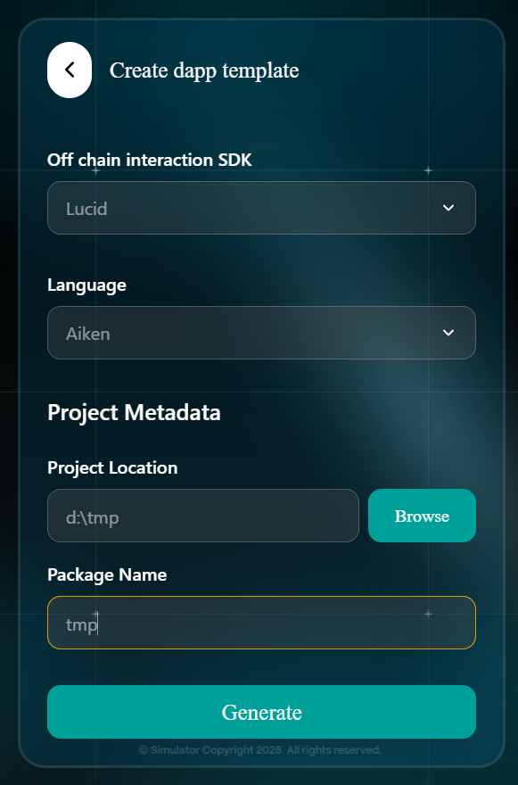

# 3. Create DApp Template



User navigate to the **"Create dapp template"** page in the extension.

<figure><figcaption></figcaption></figure>



User fills in the fields for **Off-chain** Interaction **SDK** (e.g., Lucid, Mesh), On-chain Programming Language (currently supports Aiken), **Project Location**, and **Project Name**, then clicks the "**Generate**" button to initiate the project creation process.

<figure><figcaption></figcaption></figure>



User can begin development once the template is generated



