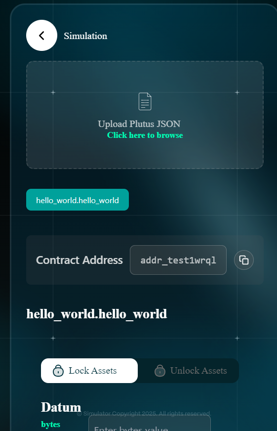
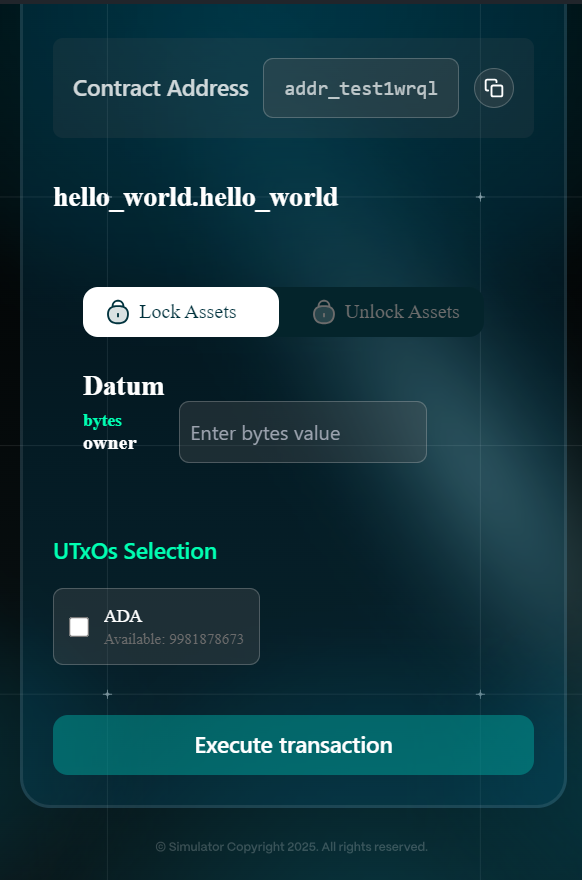
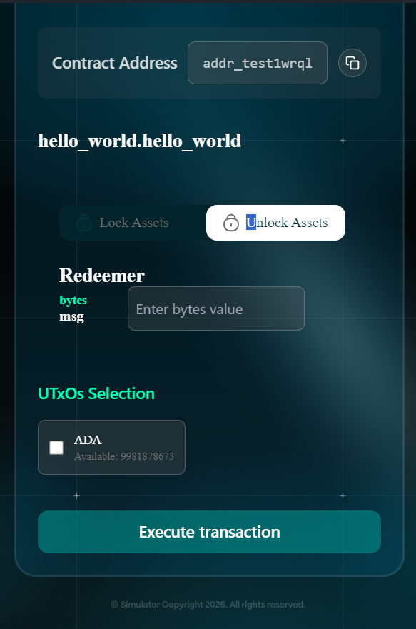
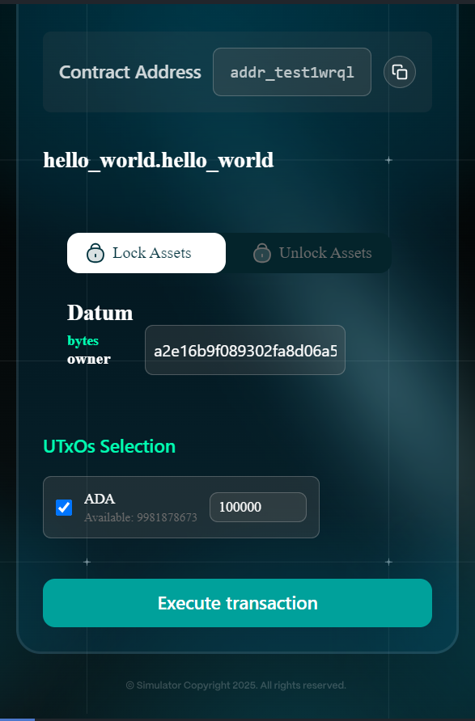
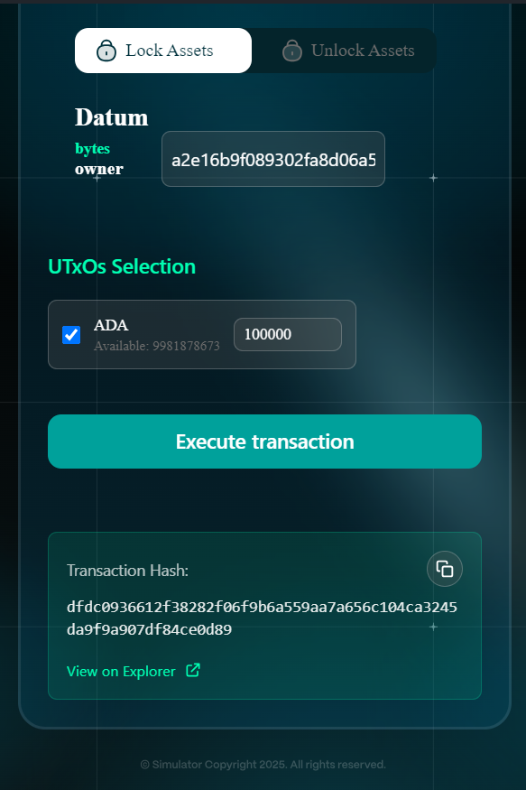

# 4. Simulation



User navigate to the **"Simulation"** page in the extension.

<figure><figcaption></figcaption></figure>



User uploads a **Plutus JSON file** generated using the Aiken compiler

<figure><figcaption></figcaption></figure>



After selecting a validator (e.g., "hello\_world.hello\_world"), the system will display the contract address, and the user will choose whether to lock or unlock assets; if locking, the datum requirement will be shown, otherwise, the redeemer will be displayed.

<figure><figcaption></figcaption></figure> <figure><figcaption></figcaption></figure> <figure><figcaption></figcaption></figure>




User enters all required fields of datum or redeemer, as specified by the contract, and selects the UTXOs for the transaction.

<figure><figcaption></figcaption></figure>



User clicks the "Execute transaction" button, and then the system will execute the transaction and return the transaction hash. After that, you can check it in the explorer.

<figure><figcaption></figcaption></figure>



