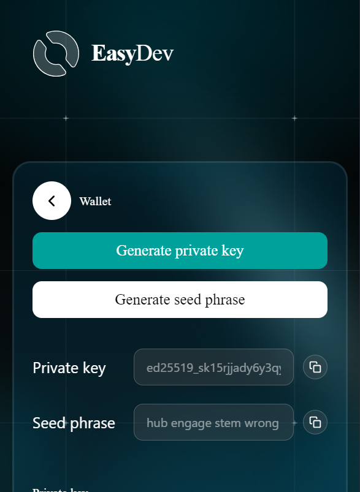

# Account Creation



User navigate to the **"Wallet"** page in the extension.

<figure><figcaption></figcaption></figure>



Users click "Generate Private Key" or "Generate Seed Phrase" button in the extension

<figure><figcaption></figcaption></figure>




The extension will display the private key and seed phrase

<figure><figcaption></figcaption></figure>




