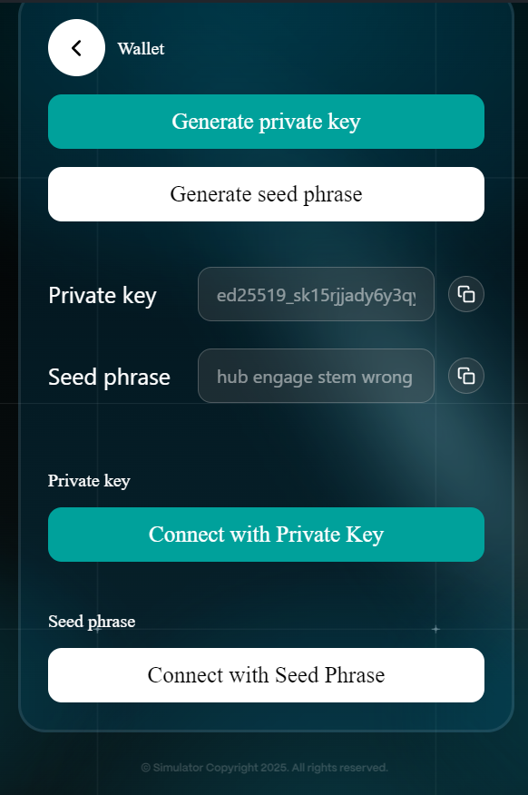

# Account Management



User navigate to the **"Wallet"** page in the extension.

<figure><figcaption></figcaption></figure>



Users click "Connect with Private Key" or "Connect with Seed Phrase" button in the extension

<figure><figcaption></figcaption></figure>



The extension will display wallet address, UTXOs, assets, and NFTs.

<figure><figcaption></figcaption></figure> <figure><figcaption></figcaption></figure>



