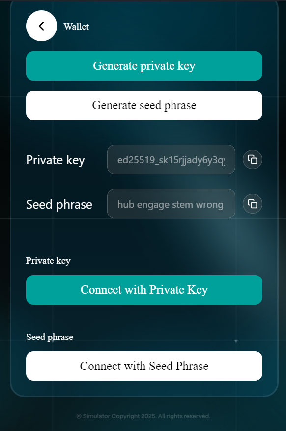
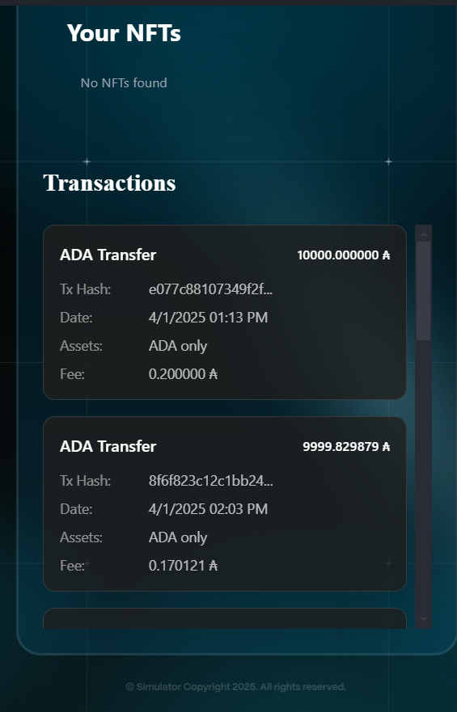

# Wallet Management



User navigate to the **"Wallet"** page in the extension.

<figure><figcaption></figcaption></figure>



Users click the "Connect with Private Key" or "Connect with Seed Phrase" button in the extension after entering their private key or seed phrase.

<figure><figcaption></figcaption></figure>



The extension will display the transaction history of the wallet address.

<figure><figcaption></figcaption></figure>


